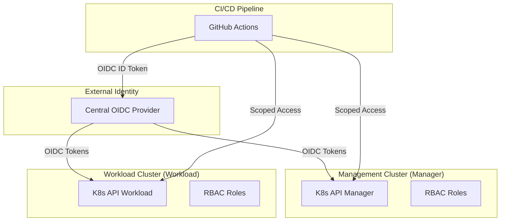

# Secure Multi-Cluster OIDC for Kubernetes

[](#)
[](#)
[](#)

This repository demonstrates a professional DevSecOps architecture for managing secure access to multiple Kubernetes clusters using **OIDC Federation**, **RBAC**, and **Secretless CI/CD**.

## 🏗️ Architecture



## 🛡️ Security Model

1.  **Identity Federation**: All human and machine identities are managed in a central OIDC provider. No long-lived service account tokens are exported.
2.  **Secretless CI/CD**: GitHub Actions uses OIDC to exchange a short-lived identity token for Kubernetes access.
3.  **Least Privilege RBAC**: Granular roles define access:
    *   `platform-admin`: Full cluster management.
    *   `developer-readonly`: Read-only access to application namespaces.
    *   `ci-deployer`: Scoped write access for automated deployments.
    *   *See [Access Model Documentation](./docs/access-model.md) for full details.*
4.  **Network Isolation**: Strict NetworkPolicies enforce zero-trust communication between namespaces.
5.  **Workload Hardening**: Pod Security Admission (PSA) enforces restricted profiles on production workloads.
    *   *See [Security Hardening Guide](./docs/security-hardening.md) for defense-in-depth details.*

## 📂 Repository Structure

*   [`infra/terraform/`](./infra/terraform/): Infrastructure as Code for clusters and OIDC provider.
*   [`helm/`](./helm/): Security and application charts.
*   [`rbac/`](./rbac/): YAML manifests for roles and bindings.
*   [`policies/`](./policies/): Network and security admission policies.
*   [`github-actions/`](./github-actions/): Workflow templates for OIDC-based deployment.
*   [`infra/terraform/`](./infra/terraform/): Production-grade EKS infrastructure code.

## 🚀 Getting Started

### Local Testing (Recommended)
Bootstrap a multi-cluster environment on your local machine using Kind:
```bash
bash scripts/bootstrap-kind.sh
bash scripts/validate-local.sh
```
*See [Local Testing Guide](./docs/local-testing.md) for details.*

### Cloud Deployment (AWS EKS)
Provision the production infrastructure using Terraform:
1.  Navigate to `infra/terraform/environments/manager/`.
2.  Run `terraform init && terraform plan`.
*See [EKS vs Kind Authentication](./docs/eks-vs-kind-auth.md) for architectural differences.*

---

## 🗺️ Local Architecture Diagram

The local dev environment uses two Kind clusters, a Keycloak OIDC provider running inside the manager cluster, and an nginx HTTPS proxy to satisfy the Kubernetes OIDC issuer requirement of HTTPS with a trusted CA.

```
Host (Linux/macOS)
│
├─── kubectl / kubelogin ─────────────────────────────────────────────────────┐
│                                                                              │
│  ┌───────────────────────────── kind: manager ───────────────────────────┐  │
│  │                                                                        │  │
│  │  kube-apiserver ──OIDC token validation──► NodePort 30443             │  │
│  │       │  --oidc-issuer-url=https://host.docker.internal:30443/...     │  │
│  │       │  --oidc-ca-file=/etc/kubernetes/pki/oidc/oidc-ca.crt         │  │
│  │       │                                                                │  │
│  │  keycloak-https-proxy (nginx)  ◄── NodePort 30443 ────────────────────┼──┼── Host :30443
│  │       │  TLS: certs/oidc-ca.crt + oidc-tls.key                       │  │       │
│  │       ▼                                                                │  │       │ (curl --resolve)
│  │  keycloak pod :80  (bitnami/keycloak)                                 │  │       │
│  │       │  realm: kube-lab                                               │  │       │
│  │       │  client: kube-oidc                                             │  │       │
│  │       │  groups: platform-admins · ci-deployers · developers           │  │       │
│  │                                                                        │  │       │
│  │  ◄── port-forward 18080 ──────────────────────────────────────────────┼──┼── Host :18080 (admin UI)
│  └────────────────────────────────────────────────────────────────────────┘  │
│                                                                              │
│  ┌───────────────────────────── kind: workload ──────────────────────────┐  │
│  │  kube-apiserver ──OIDC token validation──► (same issuer, same CA)     │  │
│  │  RBAC bindings: oidc:platform-admins · oidc:ci-deployers · oidc:developers
│  └────────────────────────────────────────────────────────────────────────┘  │
│                                                                              │
└── Token flow: kubectl → kubelogin → Keycloak OIDC → JWT → kube-apiserver ──┘
```

**Key design decisions:**
- The HTTPS proxy + self-signed CA lets Kind's kube-apiserver trust the issuer over HTTPS — required by the OIDC spec.
- `host.docker.internal` resolves on both the host (via `/etc/hosts`) and the Kind container (via `extraHosts`), giving a single stable issuer URL across both contexts.
- All RBAC ClusterRoleBindings use the `oidc:` prefix (e.g. `oidc:platform-admins`) to match the `--oidc-groups-prefix` flag on the apiserver.

---

## ▶️ Demo: 2-Minute Walkthrough

Run these steps in order to go from zero to a working OIDC-authenticated multi-cluster setup.

### 1 — Bootstrap clusters and Keycloak

```bash
# Creates kind-manager + kind-workload, deploys Keycloak, configures HTTPS proxy
bash scripts/bootstrap-kind.sh
```

Expected: both clusters running, Keycloak reachable at `https://host.docker.internal:30443`.

### 2 — Configure Keycloak (realm, client, groups, users)

```bash
bash scripts/setup-keycloak.sh
```

This is idempotent — safe to re-run. It creates:
| User | Password | Group | RBAC role |
|------|----------|-------|-----------|
| `alice.admin` | `password123` | `platform-admins` | Platform admin |
| `bob.viewer` | `password123` | `developers` | Read-only |
| `ci.deployer` | `password123` | `ci-deployers` | Namespace deploy |

### 3 — Validate end-to-end OIDC + RBAC

```bash
bash scripts/validate-oidc.sh
```

The script fetches a real JWT from Keycloak for each user and calls `kubectl auth can-i` with `--token`. All three checks must pass:

```
[PASS] alice.admin → get nodes  (kind-manager)
[PASS] ci.deployer → create deployments in app-prod  (kind-manager)
[PASS] bob.viewer  → get pods  (kind-workload / app-staging)
```

### 4 — Inspect a token manually

```bash
# Fetch alice's token
TOKEN=$(curl -s --resolve host.docker.internal:30443:127.0.0.1 \
  -d "client_id=kube-oidc&grant_type=password&username=alice.admin&password=password123" \
  https://host.docker.internal:30443/realms/kube-lab/protocol/openid-connect/token \
  | jq -r .access_token)

# Decode the payload (no signature verification needed here)
echo "$TOKEN" | cut -d. -f2 | base64 -d 2>/dev/null | jq '{sub, groups}'
```

Expected output:
```json
{
  "sub": "...",
  "groups": ["/platform-admins"]
}
```

### 5 — Use the token directly with kubectl

```bash
kubectl --context kind-manager \
  --token="$TOKEN" \
  get nodes
```

---

## 🩺 Troubleshooting

### DNS — `host.docker.internal` not resolving

**Symptom:** `curl: Could not resolve host: host.docker.internal`

**Fix:**
```bash
# Add to /etc/hosts on the host machine (done automatically by bootstrap-kind.sh)
echo "127.0.0.1 host.docker.internal" | sudo tee -a /etc/hosts

# Verify
ping -c1 host.docker.internal
```

Inside the Kind container the hostname is injected via `extraHosts` in `kind/manager.yaml`. If the control-plane pod was recreated, delete and re-create the cluster.

---

### Issuer URL — kube-apiserver can't reach OIDC discovery endpoint

**Symptom:** `apiserver` logs contain `oidc: failed to fetch provider config` or tokens are rejected with `Unauthorized`.

**Diagnose:**
```bash
# From the host
curl -v --resolve host.docker.internal:30443:127.0.0.1 \
  https://host.docker.internal:30443/realms/kube-lab/.well-known/openid-configuration \
  --cacert certs/oidc-ca.crt | jq .issuer

# From inside the kind-manager control-plane container
docker exec kind-manager curl -sk \
  https://host.docker.internal:30443/realms/kube-lab/.well-known/openid-configuration \
  | jq .issuer
```

The `issuer` value in the JSON must exactly match `--oidc-issuer-url` in the apiserver flags.

**Common causes:**
- NodePort service for the HTTPS proxy is not running: `kubectl --context kind-manager get svc -n keycloak`
- The nginx proxy pod crashed: `kubectl --context kind-manager logs -n keycloak keycloak-https-proxy`

---

### TLS — Certificate errors

**Symptom:** `x509: certificate signed by unknown authority` or `SSL certificate problem`.

**Diagnose:**
```bash
# Inspect the cert served on NodePort 30443
openssl s_client -connect 127.0.0.1:30443 -servername host.docker.internal \
  </dev/null 2>/dev/null | openssl x509 -noout -subject -issuer -dates
```

**Fix — regenerate certs and restart proxy:**
```bash
bash scripts/ensure-oidc-certs.sh   # regenerates certs/oidc-ca.crt + oidc-tls.key
# Restart the HTTPS proxy to pick up new certs
kubectl --context kind-manager rollout restart deployment/keycloak-https-proxy -n keycloak
# Re-apply the CA to the kind node and restart apiserver
bash scripts/bootstrap-kind.sh --update-ca
```

> The CA cert baked into the Kind control-plane node (`/etc/kubernetes/pki/oidc/oidc-ca.crt`) must match the cert served by the proxy.

---

### `kubectl auth can-i` failures

**Symptom:** `no` from `kubectl auth can-i` even though the token is valid.

**Step 1 — Confirm the token contains groups:**
```bash
echo "$TOKEN" | cut -d. -f2 | base64 -d 2>/dev/null | jq '{sub, groups}'
```
If `groups` is missing, re-run `setup-keycloak.sh` to add the groups mapper to the client.

**Step 2 — Check the group prefix:**
```bash
kubectl --context kind-manager get clusterrolebinding | grep oidc
```
Bindings must reference subjects with `name: oidc:platform-admins` (note the `oidc:` prefix). This matches the apiserver flag `--oidc-groups-prefix=oidc:`.

**Step 3 — Verify the binding subject:**
```bash
kubectl --context kind-manager describe clusterrolebinding platform-admin-binding
```
The `Subjects` section must list `Kind: Group, Name: oidc:platform-admins`.

**Step 4 — Check apiserver flags:**
```bash
docker exec kind-manager cat /etc/kubernetes/manifests/kube-apiserver.yaml \
  | grep oidc
```
Expected flags: `--oidc-issuer-url`, `--oidc-client-id=kube-oidc`, `--oidc-username-claim=email`, `--oidc-groups-claim=groups`, `--oidc-groups-prefix=oidc:`, `--oidc-ca-file`.

**Step 5 — Force token revalidation:**
The apiserver caches OIDC public keys. After a Keycloak restart, wait ~60 s or restart the apiserver pod:
```bash
docker exec kind-manager kill -HUP 1   # SIGHUP triggers config reload
```
