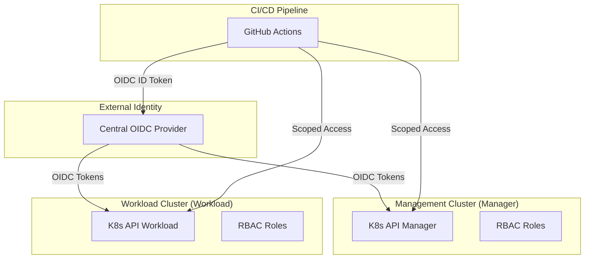

# Secure Multi-Cluster OIDC for Kubernetes

[](#)
[](#)
[](#)

This repository demonstrates a professional DevSecOps architecture for managing secure access to multiple Kubernetes clusters using **OIDC Federation**, **RBAC**, and **Secretless CI/CD**.

## 🏗️ Architecture



## 🛡️ Security Model

1.  **Identity Federation**: All human and machine identities are managed in a central OIDC provider. No long-lived service account tokens are exported.
2.  **Secretless CI/CD**: GitHub Actions uses OIDC to exchange a short-lived identity token for Kubernetes access.
3.  **Least Privilege RBAC**: Granular roles define access:
    *   `platform-admin`: Full cluster management.
    *   `developer-readonly`: Read-only access to application namespaces.
    *   `ci-deployer`: Scoped write access for automated deployments.
    *   *See [Access Model Documentation](./docs/access-model.md) for full details.*
4.  **Network Isolation**: Strict NetworkPolicies enforce zero-trust communication between namespaces.
5.  **Workload Hardening**: Pod Security Admission (PSA) enforces restricted profiles on production workloads.
    *   *See [Security Hardening Guide](./docs/security-hardening.md) for defense-in-depth details.*

## 📂 Repository Structure

*   [`infra/terraform/`](./infra/terraform/): Infrastructure as Code for clusters and OIDC provider.
*   [`helm/`](./helm/): Security and application charts.
*   [`rbac/`](./rbac/): YAML manifests for roles and bindings.
*   [`policies/`](./policies/): Network and security admission policies.
*   [`github-actions/`](./github-actions/): Workflow templates for OIDC-based deployment.
*   [`infra/terraform/`](./infra/terraform/): Production-grade EKS infrastructure code.

## 🚀 Getting Started

### Local Testing (Recommended)
Bootstrap a multi-cluster environment on your local machine using Kind:
```bash
bash scripts/bootstrap-kind.sh
bash scripts/validate-local.sh
```
*See [Local Testing Guide](./docs/local-testing.md) for details.*

### Cloud Deployment (AWS EKS)
Provision the production infrastructure using Terraform:
1.  Navigate to `infra/terraform/environments/manager/`.
2.  Run `terraform init && terraform plan`.
*See [EKS vs Kind Authentication](./docs/eks-vs-kind-auth.md) for architectural differences.*
